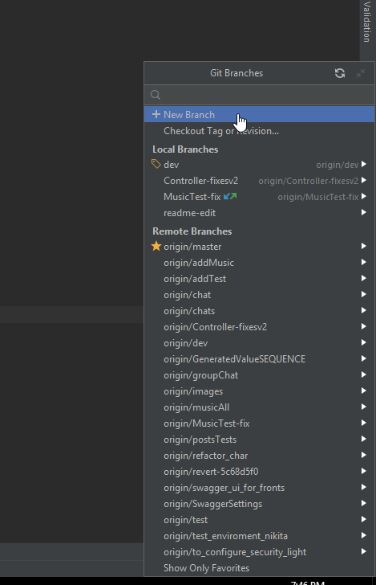
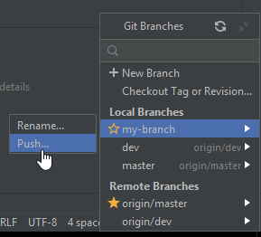
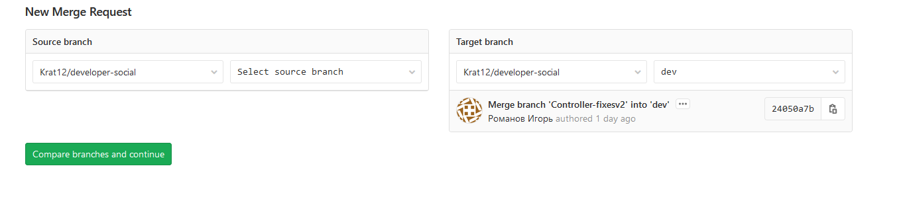

# Документация JMStack
## Работа c git
### Клонирование проекта

1. На странице репозитория убедитесь, что выбрана ветка **dev** (1), нажмите кнопку **Clone** (2), скопируйте ссылку (3).


2. Откройте **Intellij IDEA**, нажмите **Get from version control** на экране приветствия, либо **VCS | Git | Clone...** в меню.


3. Вставьте скопированную ссылку в строку **URL**, нажмите **Clone**.


### Перед внесением изменений в код
Создайте новую ветку в git-репозитории и работайте в ней. Для этого:
1. Нажмите на текущую ветку **dev** в правом нижнем углу.


2. Выберите **New branch**.



3. Введите название своей новой ветки (на ваше усмотрение) и нажмите **Create**.


### Добавление своего кода в общий репозиторий. Git push.

Прежде чем создать merge request вам необходимо подготовить вашу ветку к отправке в общий репозиторий.

1. Нажмите на текущую ветку в правом нижнем углу. Выберите опцию **dev | update**. 
Таким образом вы скачаете в свою локальную ветку **dev** все коммиты которые были замержены, 
пока вы работали в своей ветке.


2. Убедитесь, что в данный момент активна ваша рабочая ветка (занчек ярлыка слева от имени, как у ветки my-branch на скриншоте).
Выберите опцию **dev | Merge into Current**. Таким образом вы добавите все изменения из ветки **dev** в вашу ветку. При возникновении конфликтов разрешите их.


3. ---**ВАЖНО**--- Убедитесь что проект собирается и запускается.

4. Выберите вашу ветку и нажмите на **Push...**, чтобы добавить её в общий репозиторий.



### Создание merge request

1. Создайте новый merge request. В качестве **Source branch** выберите свою ветку, **Target branch** - **dev**.




2. Проверьте данные, допишите комментарии при необходимости. Обратите внимание на опцию **Delete source branch when merge request is accepted**.
Завершите создание реквеста, приложите ссылку на него в карточку таска на Trello.


## Сущности

### User

#### Поля:

- **id** - уникальный идентификационный номер пользователя;
- **email** - адрес электронной почты;
- **password** - пароль;
- **fullName** - полное имя пользователя;
- **persistDateTime** - дата регистрации;
- **isEnabled** - отметка, что учетная запись не заблокирована;
- **isDeleted** - отметка, что учетная запись не удалена;
- **city** - город пользователя;
- **linkSite** - ссылка на сайт;
- **linkGitHub** - ссылка на github;
- **linkVk** - ссылка на страницу во Вконтакте;
- **about** - краткая информация о пользователе;
- **imageLink** - фото пользователя;
- **lastUpdateDateTime** - дата последней авторизации;
- **nickname** - никнейм пользователя;
- **role** - идентификационный номер пользователя;

```
Пользователь может задавать вопросы, отвечать на вопросы и давать комментарии к вопросам и ответам.
Наделен ролью.Может помечать понравившиеся вопросы, отмечать вопросы которые были полезны. Заданный
вопрос может отметить, как решенный, указав на ответ, который помог решить проблему.
```

### Role

#### Поля:

- **id** - уникальный идентификационный номер роли;
- **name** - имя роли;

```
Определяет порядок прав действий пользователя в системе.
```

### Question

#### Поля:

- **id** - уникальный идентификационный номер вопроса;
- **title** - заголовок вопроса;
- **description** - описание вопроса;
- **persistDateTime** - дата публикации вопроса;
- **user** - идентификационный номер пользователя, опубликовавший вопрос;
- **tags** - теги, которыми обозначен вопрос;
- **lastUpdateDateTime** - дата последней редакции вопроса или добавления ответа;
- **isDeleted** - флаг, помечающий объект, как удалённый. Отображаться при запросе данный вопрос не будет;
- **answers** - ответы на вопрос;
- **commentQuestions** - комментарии к вопросу.
- **userFavoriteQuestions** - список понравившихся пользователю вопросов.
- **voteQuestions** - записи голосований по вопросу.

```
Сущность, которую инициализирует пользователь для публикации своего вопроса. Имеет заголовок, который кратко 
описывает суть вопроса, развернутое описание, с возможностью вставки фрагмента кода. Может быть помечен полями
“решен”, “любимый вопрос”. Отметка “решен” проставляется автором вопроса, с указанием ответа, который помог
решить возникший вопрос. Отметка “любимый вопрос” ставиться любым пользователем, который посчитал вопрос
актуальным и интересным. ”Тэг” проставляется автором вопроса, для классификации вопроса. Под вопросом может
также быть оставлен комментарий любым пользователем, включая автора вопроса.
```

### QuestionViewed

#### Поля

- **id** - уникальный идентификационный номер просмотра;
- **user** - идентификационный номер пользователя, просмотревшего вопрос;
- **question** - вопрос;
- **localDateTime** - дата и время просмотра;

```
Сущность, показывающая какой пользователь и когда просмотрел вопрос.
```

### VoteQuestion

#### Поля

- **id** - уникальный идентификационный номер голоса;
- **user** - пользователь, который отправил свой голос;
- **question** - вопрос, по которому ведётся голосование;
- **localDateTime** - дата и время отправки голоса;
- **vote** - значение голоса, который отправил пользователь по вопросу;
```
Таблица, которая содержит в себе записи голосования пользователей по вопросам. В таблице используется
сборный внешний ключ, который состоит из полей user, qustion, localDateTime. Для создания необходимо
передать сущности User, Question и значения голоса. Допускается передача значений только "1" и "-1".
Пользователь может проголосовать за один вопрос только с отклонением в 1 пункт. Допускается, что пользователь
может отменить свой голос, отправив противоположное значение предыдущего голоса. Или изменить свой итоговый
голос, при этом отправив повторно обратное значение. Все действия пользователя сохраняются в таблице.
Итоговое значение "полезности вопроса" является сумма всех голосов.
```

### Answer

#### Поля:

- **id** - уникальный идентификационный номер ответа;
- **persistDateTime** - дата публикации ответа;
- **updateDateTime** - дата публикации ответа;
- **question** - идентификационный номер вопроса, к которому относиться ответ;
- **user** - идентификационный номер пользователя, который опубликовал ответ;
- **htmlBody** - тело ответа;
- **isHelpful** - отметка, что именно этот ответ помог решить вопрос, к которому оно относиться. Эту
отметку может ставить только автор вопроса;
- **isDeleted** - флаг, помечающий объект, как удалённый. Отображаться при запросе данный ответ не будет;
- **isDeletedByModerator** - флаг, помечающий объект, как удалённый модератором. Отображаться при запросе данный ответ не будет;
- **dateAcceptTime** - дата, решения вопроса;
- **commentAnswers** - комментарии к ответу.
- **voteAnswers** - голосование к ответу.
```
Сущность, которую инициализирует пользователь отвечая на вопрос. Привязан к сущности question. Ответ на
вопрос может оставлять любой пользователь. Может быть предложено несколько вариантов ответов на опубликованный
вопрос. Ответ может быть помечен автором вопроса, к которому был оставлен ответ, как “решение помогло”,
обозначая тем самым, что сам вопрос решён и помог прямо или косвенно данный ответ. Под ответом пользователи
могут оставлять комментарии, которые уточняют или дополняют предложенное решение. Каждый пользователь может
оставлять под вопросом только один ответ.
```
### VoteAnswer

#### Поля

- **id** - уникальный идентификационный номер ответа;
- **user** - пользователь, который отправил свой голос;
- **answer** - ответ, по которому ведётся голосование;
- **persistDateTime** - дата и время отправки голоса;
- **vote** - значение голоса, который отправил пользователь по ответу;
```
Таблица, которая содержит в себе записи голосования пользователей по ответам. В таблице используется
сборный внешний ключ, который состоит из полей user, answer, persistDateTime. Для создания необходимо
передать сущности User, Answer и значения голоса. Допускается передача значений только "1" и "-1".
Пользователь может проголосовать за один вопрос только с отклонением в 1 пункт. Не допускается, что пользователь
может отменить свой голос. Все действия пользователя сохраняются в таблице.
```

### Comment

#### Поля:

- **id** - уникальный идентификационный номер комментария;
- **text** - содержание комментария;
- **commentType** - тип комментария. Идентифицирует родительскую сущность, к которой был оставлен комментарий
  (вопрос или ответ);
- **persistDateTime** - дата публикации комментария;
- **lastUpdateDateTime** - дата последней редакции;
- **user** - идентификационный номер пользователя, который оставил комментарий;
```
Комментарий оставляется пользователем под любым вопросом или ответом, для уточнения или дополнения к основному
посту.
```

### CommentAnswer

#### Поля:

- **id** - уникальный идентификационный номер комментария;
- **comment** - комментарий
- **answer** - ответ на который оставлен комментарий
```
Комментарий оставляется пользователем под ответом, для уточнения или дополнения к основному
посту.
```

### CommentQuestion

#### Поля:

- **id** - уникальный идентификационный номер комментария;
- **comment** - комментарий
- **question** - ответ на который оставлен комментарий
```
Комментарий оставляется пользователем под комментарием, для уточнения или дополнения к основному
посту.
```

### UserFavoriteQuestion

#### Поля:

- **id** - уникальный идентификационный номер записи об отмеченном вопросе;
- **persistDateTime** - дата постановки отметки “понравившейся вопрос”;
- **user** - идентификационный номер пользователя, который отметил вопрос, как понравившийся;
- **question** - идентификационный номер вопроса, который пользователь отметил, как понравившейся;
```
Отметка понравившегося вопроса проставляется пользователем, который счел вопрос интересным и/или полезным.
```

### Tag

#### Поля:

- **id** - уникальный идентификационный номер тега;
- **name** - название тега;
- **description** - описание тега;
- **persistDateTime** - дата создания тега;
- **questions** - список вопросов, которыми помечен данный тег;
```
Ставиться у сущности question для классификации вопроса.
```

### RelatedTag

#### Поля:

- **id** - уникальный номер записи;
- **mainTag** - идентификационный номер родительского тега;
- **childTag** - идентификационный номер дочернего тега;
```
Категоризация тэгов. Показывает взаимосвязь общего с конкретным запросом. Например тэг “База данных” будет
иметь более широкую область запросов, в то время как тэг “Hibernate” будет более предметную область, которая
одновременно подходит под широкое использование тэга “База данных”.
```

### Question_has_Tag

#### Поля

- **tag_id** - идентификационный номер тега;
- **question_id** - идентификационный номер вопроса;

```                                                  
Производная таблица связи many-to-many сущности вопросов и тегов.
```

### Editor

#### Поля:

- **id** - уникальный идентификационный номер редактора;
- **count** - правки сделанные за день
- **persist_date** - дата 
- **user_id** - идентификационный номер пользователя;
```
Сущность, которая хранит в себе историю редактирования вопроса, 
ответа или комментария сделанных пользователями.
```

### Moderator

#### Поля:

- **id** - уникальный идентификационный номер модератора;
- **persist_date** - дата назначения;
- **user_id** - идентификационный номер пользователя;
```
Сущность, которая хранит пользователей чей статус являеться модератором. 
Привилегия, выдаваемая системой в зависимости от уровня репутации участника.
```

### Reputation

#### Поля

- **id** - уникальный идентификационный номер репутации 
- **persistDate** - дата создания
- **author** - идентификационный номер автора
- **sender** - идентификационный номер отправителя
- **count** - баллы заработанные за день
- **type** - тип репутации
- **question** - идентификационный номер вопроса
- **answer** - идентификационный номер ответа

```
Сущность, которая хранит в себе историю репутации пользователей по дням. 
Новый день новая запись, для каждого пользователя (если пользователь заработал баллы иначе записи не будет).  
```

### Badge

#### Поля

- **id** - уникальный идентификационный номер знака 
- **badgeName** - имя знака
- **reputationForMerit** - минимальное количество очков репутации для получения знака
- **description** - описание знака
```
Сущность знаков.   
```

### UserBadges

#### Поля

- **id** - уникальный идентификационный номер знака 
- **ready** - имеет булевский тип, если помечается true знак получен
- **user** - идентификационный номер пользователя
- **badge** - идентификационный номер знака
```
Промежуточная сущность связывающая таблицы User и Badges.
User при регистрации получает все знаки лишь поле ready определяет заслужил пользователь знак или нет.
```

### IgnoredTag

#### Поля

- **id** - уникальный идентификационный номер знака 
- **ignoredTag** - ссылка на тег
- **user** - ссылка на профиль пользователя
- **persistDateTime** - дата добавления тега в справочник
```
Справочник тегов которые пользователь добавляет в игнорируемые
```

### TrackedTag

#### Поля

- **id** - уникальный идентификационный номер знака 
- **trackedTag** - ссылка на тег
- **user** - ссылка на профиль пользователя
- **persistDateTime** - дата добавления тега в справочник
```
Справочник тегов которые пользователь добавляет в отслеживаемые 
```

### BookMarks

#### Поля

- **id** - уникальный идентификационный номер закладки
- **user** - ссылка на профиль пользователя
- **question** - ссылка на вопрос
```
Таблица закладок
```

[Схема](https://dbdiagram.io/d/6086b027b29a09603d12295d)


## Как пользоваться конвертором MapStruct.

**MapStruct** - это генератор кода, который значительно упрощает реализацию сопоставлений между типами Java-компонентов
 на основе подхода соглашения по конфигурации.
Сгенерированный код сопоставления использует простые вызовы методов 
и, следовательно, является быстрым, безопасным по типам и простым для понимания.
Более подробно можно ознакомиться в официальной документации:https://mapstruct.org/ .

В текущем проекте **Developer Social** технология **MapStruct** используется,в основном, для 
преобразования **Dto** в **Entity** и наоборот.
Названия всех классов преобразования должны заканчиваться на «**Converter**» (например: **GroupChatConverter**) и должны храниться в пакете **converters**.
Такой класс должен быть абстрактным, помеченным аннотацией **@Mapper**.Эта аннотация отмечает класс
как класс сопоставления и позволяет процессору **MapStruct** включиться во время компиляции.
Методы должны быть абстрактными,из их названия должно быть явно понятно,какой класс
во что преобразуется. Например: (**chatDtoToGroupChat**- преобразует **ChatDto** в **GroupChat**).

Если соответствующие поля двух классов имеют разные названия, для их сопоставления
используется аннотация **@Mapping**. Эта аннотация ставится над абстрактным методом преобразования
и имеет следующие обязательные поля:

**source** - исходное поле преобразовываемого класса.
**target**- конечное поле класса,в котором должно быть значение из **source**.

Для разрешения неоднозначностей в именах полей классов можно указывать их с именем
соответствующего параметра метода преобразования.
например:(**source** = "**chatDto.title**", где **chatDto** - имя параметра метода преобразования)

По умолчанию, метод должен принимать объект преобразовываемого класса, но также
можно передавать различные другие параметры(например **Id**) и потставлять их в **source**,
чтобы в дальнейшем поле **target** приняло это значение.

Могут возникнуть ситуации,что нужно преобразовать поле в другой тип данных,например 
в коллекцию и наоборот.Тогда в аннотацию **@Mapping** следует добавить еще одно поле:
**qualifiedByName**, которое будет содержать имя метода, реализующего логику получения
нужного типа или значения. В таком случае этот метод должен быть помечен аннотацией
**@Named** c указанием названия для маппинга.
Ниже приведён общий пример:

````
{@Mapping(source = "chatDto.title", target = "title")
    @Mapping(source = "chatDto.image", target = "image")
    @Mapping(source = "userId",target ="users",qualifiedByName = "userIdToSet")
    public abstract GroupChat chatDtoToGroupChat(ChatDto chatDto,Long userId); }"
   

@Named("userIdToSet")
    public  Set<User> userIdToSet(Long userId) {
        User user = userService.getById(userId);
        Set<User> userSet = new HashSet<>();
        userSet.add(user);
        return userSet;
    }
````

## Установка локальных параметров БД.
- Для запуска проекта с локальными настройками БД. Для этого необходимо добавить переменные среды:
- Run -> Edit Configurations -> Configuration -> Environment -> Environment variables
  
- Добавляем строку. Пример:
````
DB_NAME=;DB_PORT=;DB_USERNAME=;DB_PASSWORD=;ACTIVE_PROFILE=
````
Параметры:
- **DB_NAME** - имя БД.
- **DB_PORT** - номер порта БД.
- **DB_USERNAME** - логин для подключения к БД.
- **DB_PASSWORD** - пароль для подключения к БД.
- **ACTIVE_PROFILE** - установка активного профиля. Для запуска на локальной машине указываем профиль _local_.


## Преобразование структуры базы данных FLYWAY
Изменение структуры БД (добавление/удаление/редактирование таблиц/полей 
в таблицах и т.д не происходит автоатически) - при внесении изменений в сущности, 
необходимо эти же изменения отобразить в новом файле миграции.

В терминогии flyway любые изменения в базе данных называются миграциями. 
Миграции могут быть версионированными (versioned) и повторяемыми (repeatable).
Версионированные миграции имеют версию, описание и контрольную сумму. 
Версия должна быть уникальна, а описание достаточно информативным - при виде описания 
вы должны понимать, для чего предназначена эта миграция на самом деле. 
Контрольная сумма используется для обнаружения (и блокирования) случайных изменений.
По умолчанию, миграции могут быть написаны на Java или SQL и содержать
в себе несколько утверждений.

SQL-миграции должны соответствовать определенному шаблону именования для того, 
чтобы flyway мог работать с ними. Имя файла должно содержать:

**Префикс**: V для версионированных и R для повторяемых миграций (можно изменить);
**Версию**: Версия может содержать точки и/или нижние подчеркивания
(только не для повторяемых миграций).
**Разделитель**: __ (два нижних подчеркивания);
**Описание**: слова разделяются пробелами или нижними подчеркиваниями;
**Суффикс**: .sql (настраивается).
Пример правильно названного файла с миграциями - V20200214141830__Create_hero_schema.sql.


## Правила написания тестов
1. Все классы для тестов находиться в папке **.../api**.
2. Тесты создаются согласно рест контроллерам. Например, если есть `ResourseAnswerController`, то есть тест `TestResourseAnswerController` и тестируются все api из контроллера.
3. Все тестовые классы должны наследоваться от абстрактного класса в котором описана все конфигурация тестов.
4. В пакете **test/resource/script** лежат скрипты для инициализации данных перед тестом и после его
5. Все сущности описанные в sql скриптах для загрузки тестовых данных начинаются с `id = 100`.
6. **НЕЛЬЗЯ ИЗМЕНЯТЬ УЖЕ НАПИСАННЫЕ СКРИПТЫ, ТОЛЬКО ЕСЛИ НЕ ОБАНУРЖЕН БАГ!**,  
7. На каждый метод тестового класса написаны отдельные sql скрипты 
8. Нельзя использовать аннотацию **@Transactional** для тестов.
9. структура написание скриптов следующая: script/[пакет с названием тестового контроллера]/[пакет с названием тестового метода] и далее в нем 2 скрипта Before.sql и After.sql, в Before данные, которые вы хотите, чтоб были когда запускался тест, в After удаление всех данных после выполнение тестого метода 

## Аутентификация и авторизация с помощью JWT через Postman
**JWT (JSON Web Token)** служит для безопасной передачи информации между двумя участниками (в нашем случае клиентом и сервером). Токен содержит:
- логин(email) и роль пользователя
- дату создания
- дату, после которой токен не валиден

Данные токена подписаны **HMAC-256** с использованием секретного ключа, известного только серверу аутентификации и серверу приложений(в нашем случае это одно приложение) - т.о. сервер приложений, при получении токена, сможет проверить не менялись ли его данные с момента создания.  

1) Пользователь посылает логин/пароль серверу аутентификации
2) Сервер аутентифицирует пользователя и возвращает ему **JWT**
3) К каждому запросу на сервер приложений пользователь прикрепляет **JWT**
4) На основе **JWT** сервер приложений авторизует пользователя и предоставляет доступ к ресурсу (или не предоставляет - если пользователь не прошел авторизацию или время валидности токена истекло)  

Аутентификация на сервере:
- зайти в **Postman** 
- создать POST запрос на ```/api/auth/token```
- в качестве тела запроса выбрать raw -> JSON
- вписать username(email) и password в JSON и выполнить запрос
- Если аутентификация прошла успешно сервер вернет **JWT**:  
  

Авторизация на сервере:
- Теперь, чтобы выполнить любой запрос к серверу нужно в **header** запроса создать ключ **Authorization** и в качестве значения написать ```Bearer ``` + полученный ранее токен (Bearer обязательно с пробелом):  
  
- Если время валидности токена истекло повторить процесс аутентификации

## Пагинация на фронте (JS)

1. Для работы pagination.js необходимы jquery.cookie.js и authorization_check.js с подключенными библиотеками. Скрипты должны быть выполнены до pagination.js - нам необходимо авторизоваться и получить jwt token. Для работы всех запросов требуется ***JWT token***


2. Функция **sendUrlAndNumberOfRows** позволяет универсально настроить пагинацию для любого контроллера

   a) принимает в параметры:
      - адрес контроллера ```/api/user/new``` 
      - количество объектов для показа на странице ```5```
   
   b) запускает следующие функции:
      - **getTotalCountOfItems**
      - **displayList**
      - **setupPagination**
3. Функция **getTotalCountOfItems** делает запрос на контроллер ```/api/user/new?currPage=1``` и возвращает общее количество объектов одним значением ```60```


4. Функция **displayList** динамически создает таблицу и заполняет ее всеми доступными значениями объектов на одной странице

   a) принимает параметры:
      - элемент страницы ```'table'```
      - количество объектов на странице ```5```
    
   b) ждет исполнения функции **getItemsForPage** - получение от контроллера объектов для одной страницы по **динамическому url** ```/api/user/new?currPage=1&items=5```
5. Функция **setupPagination** - создает все кнопки с номерами страниц

   a) принимает параметр: элемент страницы ```'pagination'```
   
   b) для создания каждой новой кнопки ожидает исполнения функции **paginationButton**
      - принимает параметр с номером страницы и ограниченный общим количеством возможных страниц (```60/5=12```)
      - ожидает исполнения функции **getItemsForPage** для каждой новой страницы при переходе
      - добавляет ```'active'``` для активной страницы
      
## Swagger
Swagger - это фреймворк для спецификации RESTful API, который позволяет интерактивно просматривать спецификацию,
отправлять запросы и получать ответы через Swagger UI.

С помощью Swagger-Codegen возможно сгенерировать клиета или сервер по спецификации API Swagger.

Swagger использует декларативный подход. С помощь аннотаций необходимо разметить методы, параметры, DTO.

**Swagger Tools**

Swagger или OpenAPI framework состоит из 4 основных компонентов:

- Swagger Core - позволяет генерировать документацию на основе существующего кода основываясь на Java Annotation.

- Swagger Codegen - позволит генерировать клиентов для существующей документации.

- Swagger UI - красивый интерфейс, который представляет документацию. Дает возможность просмотреть какие типы запросов есть, описание моделей и их типов данных.

- Swagger Editor - Позволяет писать документацию в YAML или JSON формата.

Чтобы войти в Swagger UI - необходимо, после запуска приложения в браузере,  ввести один из следующих адресов:
- http://localhost:8091/swagger-ui/     
- http://localhost:8091/swagger-ui/index.html


**JWT авторизация**

Чтобы оправлять запросы через Swagger UI были авторизированы - необходимо выполнить следующие действия:
1. Получить JWT токен:

    a) Через Postman

    b) Через Swagger-UI:

            -выбрать поле Authentication

            -Authenticate user
            
            -нажать кнопку "Try it out"

            -ввести имя пользователя и пароль

            -нажать Execute

            -скопировать токен из Response body

2. Нажать на кнопку **Authorize** и в появившемся окне в поле Value ввести токен в виде
"Bearer eyJ0eXAiOiJKV1QiLCJhbGciOiJIUzI1NiJ9.eyJzd........."


3. Нажать **Authorize**, после чего можно отправлять остальные запросы из Swagger UI в случае необходимости.


**Основные аннотации используемые для документирования кода:**

- @Operation - Описывает операцию или обычно метод HTTP для определенного пути.
- @Parameter - Представляет один параметр в операции OpenAPI.
- @RequestBody - Представляет тело запроса в операции
- @ApiResponse - Представляет ответ в операции
- @Tag - Представляет теги для операции или определения OpenAPI.
- @Server - Представляет серверы для операции или для определения OpenAPI.
- @Callback - Описывает набор запросов
- @Link - Представляет возможную ссылку времени разработки для ответа.
- @Schema - Позволяет определять входные и выходные данные.
- @ArraySchema - Позволяет определять входные и выходные данные для типов массивов.
- @Content - Предоставляет схему и примеры для определенного типа мультимедиа.
- @Hidden - Скрывает ресурс, операцию или свойство
- @ApiParam - Предназначена для параметров запроса ресурсов API

Примеры использования:

````
@Tag(name = "User", description = "The User API")
@RestController
public class UserController {}
````
```
@Operation(summary = "Gets all users", tags = "user")
    @ApiResponses(value = {
            @ApiResponse(
                    responseCode = "200",
                    description = "Found the users",
                    content = {
                            @Content(
                                    mediaType = "application/json",
                                    array = @ArraySchema(schema = @Schema(implementation = UserApi.class)))
                    })
    })
    @GetMapping("/users")
    public List<UserApi> getUsers()

```
```
@Operation(summary = "Get list of answers by question id", responses = {
            @ApiResponse(description = "Got list of answers", responseCode = "200",
                        content = @Content(array = @ArraySchema(schema = @Schema(implementation = AnswerDto.class)))),
            @ApiResponse(description = "No answers with such question id - return empty list", responseCode = "200"),
            @ApiResponse(description = "Wrong type of question id", responseCode = "400")
    })
    @GetMapping
    public ResponseEntity<?> getAnswerByQuestionId(@PathVariable Long questionId) {
        return  ResponseEntity.ok(answerDtoService.getAnswerById(questionId));
    }
```

Для получения более детальной информации воспользуйтесь одной из ссылок:

- https://habr.com/ru/post/541592/
- https://habr.com/ru/post/536388/
- https://swagger.io/docs/specification/about/


